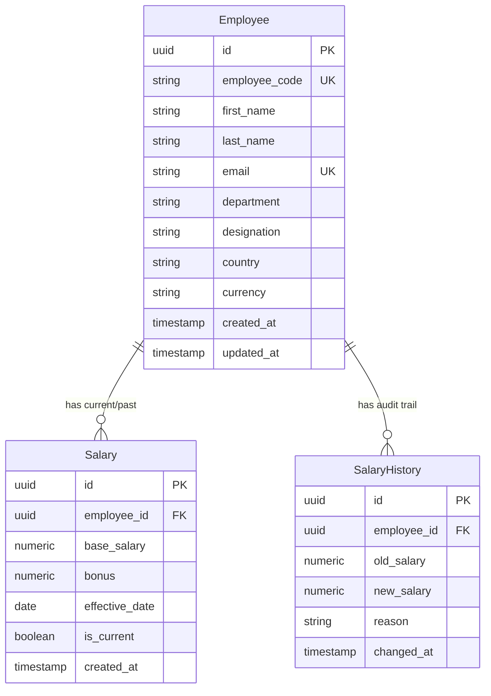

# Database Design

## Employee

Stores employee master information.

Fields:

* `id` (UUID, Primary Key)
* `employeeCode` (varchar, Unique Index)
* `firstName` (varchar)
* `lastName` (varchar)
* `email` (varchar, Unique Index)
* `department` (varchar, Index)
* `designation` (varchar)
* `country` (varchar, Index)
* `currency` (varchar)
* `createdAt` (timestamp)
* `updatedAt` (timestamp)

Indexes:

* `IDX_56162b5f24af743a154680684f` on `employee_code` (Unique)
* `IDX_765bc1ac8967533a04c74a9f6a` on `email` (Unique)
* `IDX_a927eecda70146bdf59674d939` on `department`
* `IDX_a3ef94443aea823b546594c7d7` on `country`

---

## Salary

Stores current and historical salary records.

Fields:

* `id` (UUID, Primary Key)
* `employeeId` (UUID, Foreign Key referencing Employee)
* `baseSalary` (decimal(15,2), Check: `>= 0`)
* `bonus` (decimal(15,2), Check: `>= 0`)
* `effectiveDate` (date)
* `isCurrent` (boolean, default: true)
* `createdAt` (timestamp)

Relationships:
* Employee (1) -> (N) Salary

Indexes:
* `IDX_7147253b7b7085f033753d4f4e` on `(employee_id, is_current)` — Fast lookup for an employee's current salary.
* `UQ_employee_current_salary` on `(employee_id) WHERE is_current = true` (Unique Partial Index) — Database-level constraint guaranteeing that each employee can only have at most one current active salary.

---

## SalaryHistory

Stores salary change audit records.

Fields:

* `id` (UUID, Primary Key)
* `employeeId` (UUID, Foreign Key referencing Employee)
* `oldSalary` (decimal(15,2), Check: `>= 0`)
* `newSalary` (decimal(15,2), Check: `>= 0`)
* `reason` (varchar)
* `changedAt` (timestamp)

Purpose:
Maintain a complete, immutable audit trail for compensation changes.

Relationships:
* Employee (1) -> (N) SalaryHistory

Indexes:
* `IDX_dab273bfeb6e0fbd0f228f4660` on `(employee_id, changed_at)` — Ordered lookup for salary history timelines.

---

## Entity Relationship Diagram

