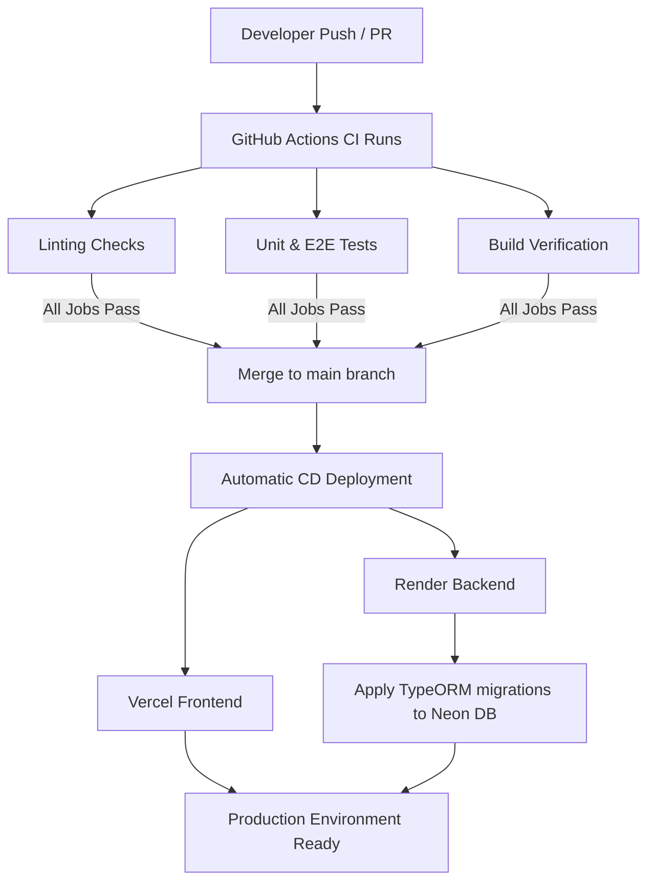

# DevOps & CI/CD Strategy

## Objective

Ensure code quality, deployment consistency, and reliable releases through automated workflows.

---

# CI Strategy

GitHub Actions is used as the Continuous Integration platform.

## Backend Validation

* Install dependencies (`npm ci`)
* Run ESLint code checks
* Run unit tests with code coverage enforcement (98% threshold)
* Run E2E integration tests (against a PostgreSQL service container)
* Verify application production build compiles successfully

## Frontend Validation

* Install dependencies (`npm ci`)
* Run ESLint code checks
* Run TypeScript type checks (`tsc -b`)
* Run unit tests with code coverage enforcement (95% threshold)
* Verify production build compiles successfully

---

# CD Strategy

## Frontend

Platform:

* Vercel

Deployment Trigger:

* Merge to `main` branch (automatic trigger via Vercel GitHub Integration)

## Backend

Platform:

* Render

Deployment Trigger:

* Merge to `main` branch (automatic trigger via Render Deploy Hook upon successful CI execution)

## Database

Platform:

* Neon PostgreSQL

Managed externally from application deployments (schema migrations are applied sequentially using version-controlled migrations via TypeORM CLI).

---

# Deployment Flow

---

# Benefits

* **Faster feedback cycle**: Immediate verification of pull requests prevents breaking changes.
* **Consistent quality checks**: Automated code standards validation and testing.
* **Reduced deployment risk**: Successful production compilation is verified in CI prior to deployment.
* **Automated releases**: Direct Vercel and Render integration simplifies deployments.
* **Easier maintenance**: Clear logs for debugging builds, linting, and tests.

---

# Environment Variables

## Backend

* `DATABASE_HOST`
* `DATABASE_PORT`
* `DATABASE_USERNAME`
* `DATABASE_PASSWORD`
* `DATABASE_NAME`
* `PORT`
* `NODE_ENV`
* `FRONTEND_URL`

## Frontend

* `VITE_API_BASE_URL`

These variables are managed through deployment platform configuration panels and are never committed to source control.
